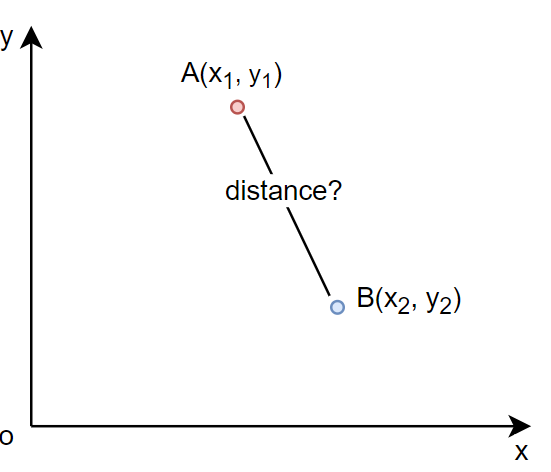
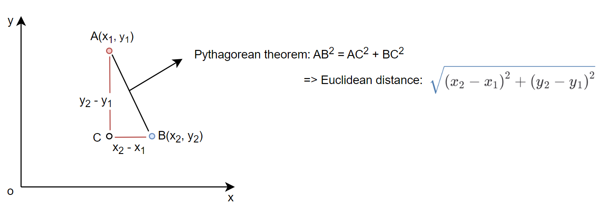

## References
- [Euclidean Distance](https://en.wikipedia.org/wiki/Euclidean_distance)
- [Pythagorean Theorem](https://en.wikipedia.org/wiki/Pythagorean_theorem)
## Example
#### 2D

How to calculate the distance between A and B?  

Depend on 2 point A and B, we can write the right triangle then using the Pythagorean to calculate the distance between A and B  

